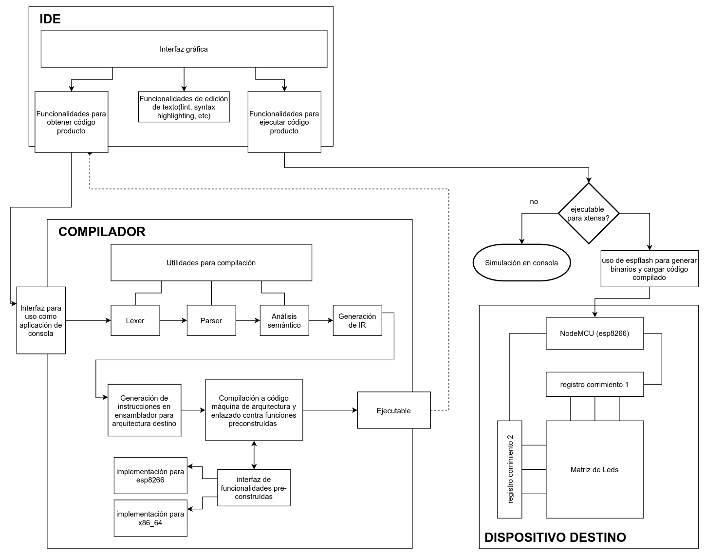
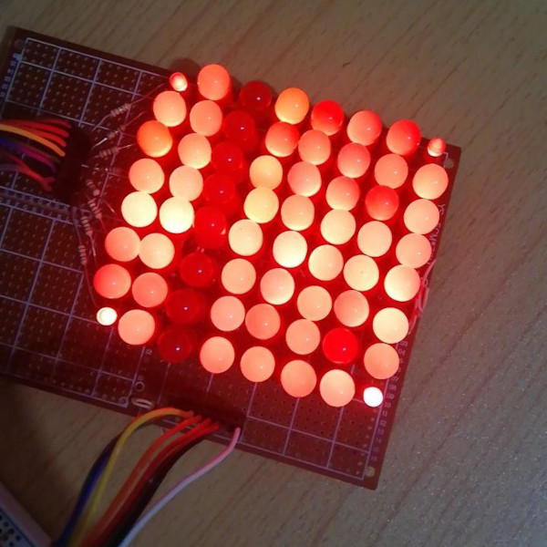
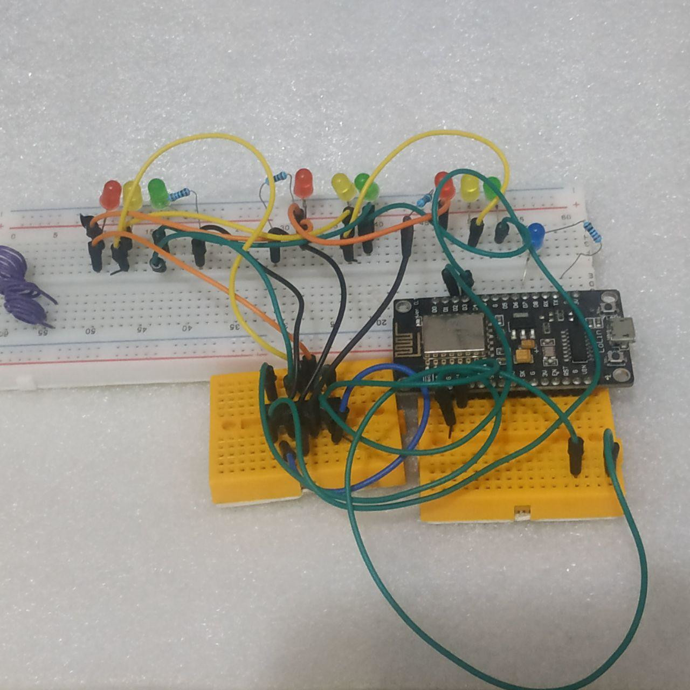

---
title:
  Instituto Tecnológico de Costa Rica\endgraf\bigskip \endgraf\bigskip\bigskip\
  Proyecto Final - AnimationLed \endgraf\bigskip\bigskip\bigskip\bigskip
author:
  - José Morales Vargas, carné 2019024270
  - Alejandro Soto Chacón, carné 2019008164
  - José Alejandro Chavarría Madriz, carné 2019067306
  - Natalia González Bermúdez, carné 2019165109
date: \bigskip\bigskip\bigskip\bigskip Area Académica de\endgraf Ingeniería en Computadores \endgraf\bigskip\bigskip\ Lenguajes, Compiladores \endgraf e intérpretes (CE3104) \endgraf\bigskip\bigskip Profesor Marco Hernández Vásquez \endgraf\vfill  Semestre I
header-includes:
  - \setlength\parindent{24pt}
  - \usepackage{url}
lang: es-ES
papersize: letter
classoption: fleqn
geometry: margin=1in
fontsize: 12pt
fontfamily: sans
linestretch: 1.15
bibliography: doc/bibliografia.bib
csl: /home/josfemova/UsefulRepos/styles/ieee.csl
nocite: |
  @rust-gui, @gtk-rs ,@gtk-sourceview
...

\maketitle
\thispagestyle{empty}
\clearpage
\tableofcontents
\pagenumbering{roman}
\clearpage
\pagenumbering{arabic}
\setcounter{page}{1}

# CE3104-AnimationLed

# 1.Diagrama de arquitectura

# 2. Alternativas de solución consideradas y justificación de la seleccionada

## 2.1. Lenguaje de programación para implementación

La primera decisión sobre la arquitectura del proyecto fue sobre el o los lenguajes de programación a utilizar.
El grupo se había formado previamente a la entrega de la especificación, por lo cual esto fue discutido de forma
temprana. Habían al menos tres propuestas principales. La primera era realizar un proyecto completamente utilizando
solo C/C++, esto ya que las herramientas a las que se gravitan por defecto trabajan de una u otra manera con estos
lenguajes (Arduino, Yacc, Lex). La segunda propuesta era una derivada de la anterior: compilador y programación
del MCU sería realizada utilizando C/C++, pero el editor de código se haría en un lenguaje de un nivel un poco
más alto para facilitar la creación de la interfaz gráfica.

Previo a que se diera la especificación, se experimentó con la posibilidad de una tercera propuesta relativamente
distinta, en búsqueda de enriquecer la experiencia pedagógica. La propuesta consistía en desarrollar todos los
componentes del proyecto utilizando únicamente el lenguaje de programación Rust. Dicho lenguaje es relativamente
nuevo, pero tiene ciertas características que lo hacen particularmente interesante. El lenguaje permite un nivel
de control similar a C++, pero ha tomado nota de los problemas que presentan otros lenguajes de bajo nivel, por
lo que ha buscado inspiración en varios lugares. Presenta características de lenguajes relativamente más modernos
como python, y provee algunas funcionalidades inspiradas en lenguajes funcionales. Uno de los aspectos más
esenciales a tomar en cuenta es que Rust es un lenguaje cuya prioridad es la correctitud y la "seguridad" de
código, lo que suele minimizar el tiempo utilizado en resolución de problemas. El equipo encontró interesante
trabajar en dicho lenguaje y se consideró que podría ser más productivo para nuestro proceso de aprendizaje el
experimentar con Rust en vez de tomar un camino más familiar. La expresividad del lenguaje también fue un factor
a tomar en cuenta, y se consideró que Rust presentaba un balance adecuado entre capacidades y facilidad para
desarrollo. El recurso principal de consulta fue el mismo manual del lenguaje [@rustbook].

Anteriormente se mencionaba que se "experimentó" con la propuesta. Esto es porque inicialmente no se sabía que
tan factible sería el uso de Rust para la producción de código a a ser ejecutado en el microcontrolador. Arduino
es basado exclusivamente en C++, y todas las funcionalidades dependen de código no portable a Rust.
Afortunadamente se encontró una iniciativa experimental para dar soporte de Rust a los microcontroladores de
Espressif [@mabez],principalmente los MCU esp32 y esp8266. Para poder ejecutar código Rust en un microcontrolador
esp8266 fue necesario entonces compilar una versión especial de LLVM que provee soporte a la arquitectura de Xtensa
[@rust-xtensa](usada en los MCU mencionados), lo que al mismo tiempo requería descargar el toolchain de Espressif
para desarrollo en el esp8266 [@esp8266-toolchain]. Lo anterior ya permite trabajar sobre el microcontrolador, sin
embargo, todavía era necesario una biblioteca de abstracción de hardware (equivalente a las que se utilizan en
arduino). Para esto se recurrió a la biblioteca (o "crate" en términos de Rust) esp8266-hal [@esp8266-hal].
Adicionalmente, se recurrió a una herramienta de cargado de código al esp8266 llamada esptool [@esptool]. La
misma también asiste el proceso de ejecución del ambiente de desarrollo implementado. Utilizando el ambiente
descrito anteriormente, se logró comprobar la viabilidad de desarrollar el proyecto completamente en Rust. Si
bien la biblioteca de abstracción de hardware es algo reducida, se consideró que era suficiente para los requisitos
del proyecto. La biblioteca también da herramientas suficientes para implementar algunas funcionalidades
especificadas en el documento de referencia técnica del esp8266 [@esp8266-techref].

La complejidad del proceso para poder ejecutar código Rust sobre el esp8266 sí presentó una duda particular.
El equipo ya sabía que era factible usar Rust, ¿pero sería más provechoso que utilizar C++ con arduino? Se
consideró que la dificultad de uso de la plataforma para ejecución de código era un precio aceptable a pagar
por las ventajas que ofrece trabajar en un lenguaje como Rust. Otro factor que se tomó en cuenta era que varias
herramientas de Rust facilitarían la integración del código completo del proyecto, lo que daría una reducción
neta del tiempo de desarrollo y pruebas.

## 2.2. Componentes electrónicos

El equipo tenía varios microcontroladores a disposición. Se consideraron principalmente tres opciones, esp32,
esp8266 y arduino pro micro. Se hizo un balance entre facilidades para desarrollar, características ofrecidas
y disponibilidad. La mejor combinación de las características mencionadas se encontró en el esp8266. La
disponibilidad era especialmente importante, y del esp8266 el equipo posee cuatro muestras distintas en
total. Simultáneamente cada sub-equipo solo tiene un MCU operacional, pero mantiene otro como un respaldo
en caso de errores que puedan dañar el dispositivo. Datos sobre funcionalidades de los puertos disponibles
en el dispositivo fueron obtenidas de [@esp8266-pinout].

Otra razón por la cual se decidió utilizar el esp8266 fue su memoria flash, específicamente la disponible
para programas ejecutables en su breakout open source conocido como NodeMCU. Los NodeMCU a utilizar poseen
un tope de memoria disponible para programa de 1MB, lo cual da un grado de libertad para los programas
compilados adecuado, además de que permite escribir la biblioteca de runtime del dispositivo con estructuras
de datos dinámicas, puesto permite la asignación de memoria en un heap. El mapa de memoria del dispositivo
se obtuvo de [@esp8266-hal].

Leds y resistencias fueron seleccionas según disponibilidad, aunque para el valor específico de las últimas
se prefirió usar algo que evitara la posibilidad de que se quemara cualquiera de los leds, en detrimento de
la luminosidad posible en la configuración.

Para control de la matriz, se recurrió al uso de un registro de corrimiento 74lS164N, cuya hoja de datos
puede ser encontrada en [@shiftregister-datasheet], para registrar los leds activos de cada columna según
fila. Esta decisión fue más por disponibilidad que otro factor, aunque una aspecto conveniente del
dispositivo es que es fácilmente reemplazable por registros de corrimiento fáciles de conseguir (como
el 74HC595). Para controlar el encendido secuencial de cada fila se utilizó otro registro de corrimiento,
utilizándolo similar a como se utiliza un multiplexor. La razón por la que no se procedió a utilizar
directamente un multiplexor es que a nivel de programación resulta más simple implementar las funciones
necesarias para manipular un solo componente y cambiar los valores específicos en los llamados a esas
funciones, que implementar conjuntos de funciones para dos componentes distintos. Para poder tomar la
decisión anterior se recurrió a la hoja de datos del multiplexor disponible en [@multiplexor-datasheet]
para realizar una estimación sobre la complejidad de implementación.

## 2.3. Máquina virtual vs generación de código máquina

Para la ejecución de código en el microcontrolador habían dos opciones principales: programar una máquina
virtual que ejecute los comandos, o producir código de máquina que se ejecute directamente sobre la
plataforma. Para decidir cual acercamiento tomar se compararon aspectos de complejidad conceptual,
fuentes disponibles para guiarse en la implementación y complejidad de ejecución.

El acercamiento de implementar una máquina virtual con operaciones propias se consideró menos complejo
a nivel conceptual, aunque su complejidad de implementación era mayor que la de una generación de código
directa. Entre las ventajas principales de este método está el poder definir una interfaz de alto nivel,
que permite ejecución relativamente directa de algunas operaciones. Lo anterior parecería indicar que la
complejidad de implementación es reducida, sin embargo, si se quisiese poder correr el código por completo
en el microcontrolador sin necesidad de estar conectado a un programa intermediario, ciertas dificultades
mayores empiezan a presentarse, e incluso con un intérprete intermedio, surgen dificultades similares si
no es que iguales. En primer lugar, se debía implementar por completo un set de instrucciones que no solo
contiene instrucciones de alto nivel, sino que también debe ser capaz de interpretar comandos como saltos
condicionales, comparaciones, operaciones, entre otros. Lo anterior significaba que el equipo debía asumir
una tarea adicional de definir una infraestructura virtual para poder interactuar con el microcontrolador.
Ahora,no solo debía definirse dicha máquina virtual, sino que debía implementarse en el mismo código del
programa.

En contraste, el acercamiento de producir directamente código ejecutable tiene una complejidad aparente
mayor, sin embargo provee ventajas innegables, entre ellas que prescinde de la definición de una máquina
virtual. Este acercamiento es algo diferente en cuanto a funcionamiento. En tiempo de compilación, en vez
de crear un ejecutable para la máquina virtual, se crea un ejecutable para el procesador del microcontrolador
mismo, y las funcionalidades complejas se pueden acceder por medio de una biblioteca previamente definida
en Rust. El reto principal de este acercamiento es la producción del código ensamblador para arquitectura
Xtensa, con la cual el equipo no tiene experiencia previa, aunque un miembro sí tiene experiencia previa
trabajando con lenguajes de ensamblador de otras arquitecturas. Cabe notar que la dificultad del proceso
consiste en la generación de los procedimientos a partir de las instrucciones primitivas, pero la
documentación de estas primitivas es sumamente directa y simple. Dicha documentación puede ser encontrada
en [@xtensa-assembly].

Después de una reunión para decidir sobre este aspecto de la implementación del proyecto, el equipo decidió
seguir el acercamiento de producción de código de máquina directamente. Se consideró que si bien la complejidad
aparente de este método era mayor, su complejidad real y tiempo de implementación sería menor. Además se
consideró que sería más provechoso para el proceso de aprendizaje la generación de código de máquina real.
No puede omitirse el hecho de que también entra en juego un aspecto de preferencia personal. Al equipo le
pareció más entretenido y atractivo el implementar un compilador a código de máquina real, que implementar
un transpilador a un código de máquina virtual que no se utiliza en ambientes de trabajo reales.

El compilar a código de máquina real también puede proveer algunas ventajas mayores, por ejemplo, la
posibilidad de simular el comportamiento de hardware en un ambiente relativamente seguro, sin necesidad
de re-implementar la definición de máquina virtual mencionada anteriormente. La representación intermedia
es transformable tanto en código de ensamblador para la arquitectura de xtensa lx106 como lo es para
x86_64. Esto significa que el único requisito para realizar simulaciones sin necesidad de tener hardware
es re-implementar la biblioteca estándar para la arquitectura destino deseada. En el caso de x86_64, para
llevar a cabo esta traducción y crear la simulación, se utilizó el manual de referencia en [@x86-assembly].

## 2.4. Uso de Lex y Yacc

Se exploró la posibilidad de utilizar herramientas como Lex y Yacc para facilitar el proceso de compilado.
Si bien las herramientas ofrecen características poderosas, una pregunta fundamental es si la simplificación
de la implementación del compilador es un neto bueno. Un manual para estas herramientas [@lexyacc, p.4]
indica que el proceso de escribir compiladores fue simplificado considerablemente cuando estas herramientas
estuvieron disponibles por primera vez para el público. También, Rust no resultaría ser una dificultad en
cuanto a soporte de estas herramientas, ya que si bien sus versiones originales son para otro lenguaje de
programación, hay versiones equivalentes de estas herramientas para Rust. En cierta forma, lo señalad
parecería indicar que la decisión más conveniente sería utilizar estas herramientas, pero el equipo decidió
en contra de esto, ¿por qué?

Como el equipo de trabajo está integrado por estudiantes, debe notarse que es imperativo entonces realizar
un balance entre dos aspectos fundamentales: conveniencia y aprendizaje. No siempre la opción más conveniente
es la mejor. El objetivo principal detrás de todo proyecto es el aprender y profundizar la materia vista en
clase. El equipo consideró que el uso de estas herramientas sería conveniente en términos de tiempo, sin
embargo, prescindir de estas herramientas sería más conveniente de términos de aprovechamiento de la
experiencia de aprendizaje. La intención principal del equipo y uno de los factores que jugó un papel mayor
en la toma de varias de las decisiones, es el escribir el compilador bajo las condiciones más cercanas a la
realidad. Lex y Yacc forman parte de la realidad, no se niega eso, pero hubo un momento en el que no, y no
necesariamente deberían ser las única forma de escribir Tomando en consideración lo discutido anteriormente,
el equipo consideró que lo mejor sería prescindir de estas herramientas, puesto que era lo más provechoso
para nuestro proceso de aprendizaje.

# 3. Problemas conocidos

# 4. Actividades realizadas por estudiante

# 5. Problemas encontrados

## 5.1. Dificultades con uso de timers de hardware en la plataforma del esp8266

### Descripción

Interrupciones del Timer1 en la biblioteca de rust para el esp8266 tenían una documentación impropia, lo
que dificultó el desarrollo de las funcionalidades pre-construídas para este dispositivo. Si se seguían
las instrucciones tal como estaban, las interrupciones no funcionaban adecuadamente.

### Intentos de solución

1. Se trató de replicar la funcionalidad dentro de los ejemplos del repositorio de la biblioteca para
  verificar el funcionamiento de distintas interrupciones disponibles en el dispositivo. En específico,
  se trato de modificar el ejemplo de interrupciones de UART y adaptarlo al caso del Timer1. Esto no logró
  indicar la solución, sin embargo, se obtuvo información valiosa, puesto que al comparar la programación
  de ambas interrupciones en la biblioteca se identificaron diferencias importantes.
2. Ante las dificultades en tratar de configurar la interrupción, se intentó contactar directamente a los
  desarrolladores de la biblioteca de abstracción de hardware. Un integrante se unió al canal de matrix del
  proyecto para tratar de obtener una guía un poco más precisa del procedimiento, ya que la documentación
  respecto al mismo era prácticamente nula. No se logró obtener respuesta sobre este problema en específico,
  aunque posteriormente este contacto se mantuvo para preguntar sobre problemas que parecían surgir durante
  el desarrollo del tercer intento de solución.
3. Entre las diferencias en las interrupciones de UART y Timer1 había un paso fundamental, y es que al agregar
  una interrupción al UART, la máscara de esta interrupción se activaba, por lo cual el dispositivo era ahora
  capaz de llamar las funciones asignadas a dicha interrupción. Para el Timer1 el caso era similar, por lo que
  se investigó como activar la máscara del timer en la biblioteca. Inicialmente, este procedimiento parecía
  suficiente para resolver el problema, sin embargo, ciertas inconsistencias parecían indicar que habían
  problemas más complejos involucrados, entre ellos, la forma en la que la biblioteca configura el timer
  cuando inicia la aplicación. De activarse el timer, la ejecución del hilo principal dependía de qué tanto
  se hiciera en la función de interrupción. Llegando a cierto nivel de complejidad, nunca se entraban a las
  funciones del hilo principal, lo que derrotaba el propósito de utilizar una interrupción de hardware para
  llevar a cabo las tareas transparentes al usuario.

### Solución encontrada

Tomando en cuenta que la funcionalidad de la interrupción, la configuración del timer y la activación de la
máscara de la interrupción eran operaciones separadas, se buscaron los puntos de fallo. El problema encontrado
cuando se intentaba implementar lo descrito en el segundo intento de solución parecía indicar que las
interrupciones eran tan constantes que era prácticamente imposible para el programa escapar de las mismas. Este
problema parecía indicar que sería necesario manipular esta interrupción a bajo nivel para poder disminuír la
constancia de estas interrupciones. Para comprender mejor como realizar esta manipulación se recurrió al video
en [@timers-scott]. El video explica como realizar una manipulación similar para obtener mejores frecuencias
de PWM en un Arduino UNO, sin embargo, los principios detrás de la manipulación son los mismos. El video implicaba
que era necesario una manipulación directa de registros, entre ellos, uno que permite configurar el pre-escalador
del timer.

En [@esp8266-techref] se encontró la documentación sobre cada uno de los espacios en el registro de control del
timer, y se identificaron dos valores de vital importancia: `FRC1_LOAD_ADDRESS` y `FRC1_CTRL_ADDRESS`. El primero
permite modificar el valor al que debe llegar el reloj para causar una interrupción, y dentro del segundo registro
se encuentra el valor del prescale-divider, el cual puede tomar valores de 1, 16 o 256. Por defecto, en la
biblioteca estos registros se manipulan para tener un contador de 1 con un divisor de 256. Se decidió entonces
modificar los registros para tener un contador fuertemente mayor, y se logró confirmar que las inconsistencias
desaparecían.

Se realizaron pruebas de comunicación con UART de manera simultánea que se ejecutaban las interrupciones, y se
comprobó efectivamente que la consistencia de los procesos en el hilo principal dependía del valor en los registros
mencionados anteriormente, ya que dependiendo del retraso en la interrupción del timer, UART funcionaba o no
funcionaba (recordar que la frecuencia de interrupciones era $80\text{ MHz/256}$ en el modo por defecto). La
información obtenida en estas pruebas fue utilizada para realizar una decisión sobre la frecuencia de las
interrupciones, de modo que se decidió configurar el divisor en 1 y el valor en `LOAD` como 8000, esto pues
$80\text{ MHz/8000} = 10^4 \text{ interr./s}$, es decir, 10 interrupciones por milisegundo. Este valor asegura
una resolución de interrupción suficiente como para no afectar significativamente el rendimiento del sistema,
además de que con la misma no hay dificultad en implementar funcionalidades de pausa con resoluciones de milisegundos.

### Conclusiones

1. La manipulación de registros de manera directa es una técnica útil para obtener el comportamiento deseado en un
  timer de hardware.
2. Las funcionalidades de ciertos procesos en un microcontrolador pueden verse afectadas seriamente por la
  frecuencia de interrupción.
3. Una biblioteca experimental puede tener funcionalidades incompletas o documentadas de manera insuficiente, lo
  cual puede forzar a un usuario de la biblioteca a tener que completar o modificar la implementación de dicha
  funcionalidad.

### Recomendaciones

- La frecuencia de interrupciónes en un sistema embebido debe ser tal que se eviten romper contratos de tiempo
  de ejecución para otros procesos, tal como son los procesos de comunicaciones.
- Cuando se trabaje con bibliotecas experimentales es fundamental presupuestar porciones de tiempo importantes
  que puedan utilizarse para lidiar con funcionalidades incompletas o mal implementadas, ya que las mismas
  pueden comprometer el tiempo de realización de un proyecto de formas no triviales.

### Bibliografía

- Para la resolución de este problema se recurrió principalmente a [@esp8266-techref] y [@timers-scott], aunque
  también fue de gran utilidad [@timers-shawn]. La implementación de las modificaciones fue posible gracias a la
  documentación de la biblioteca base sobre la cual trabaja la capa de abstracción de hardware, dicha documentación
  puede ser encontrada en [@esp8266-rustdoc].

## 5.2. Archivo de memoria incorrecto en construcción de ejecutable para esp8266

### Descripción

Al iniciar la ejecución del programa compilado dentro del contexto de la carpeta del proyecto, el comportamiento
del sistema parecía indicar que el microcontrolador únicamente ejecutaba una iteración de las instrucciones que
se le indicaban en un bucle infinito, lo que parecía apuntar a pérdida del estado global, representado como un
struct que contenía la información del dispositivo y estado de la matriz de leds.

### Intentos de solución

1. Inicialmente se creyó que era posible que el problema estuviese relacionado a particularidades encontradas al
  experimentar inicialmente con el desarrollo de programas para el dispositivo. Estas particularidades se creían
  tenían origen en algunas definiciones de operaciones atómicas las cuales no estaban correctamente definidas en
  [@rust-xtensa]. Se intentaron diferentes métodos para tratar de solucionar este problema aparente, sin embargo
  nada parecía indicar que se estuviese más cerca de la solución.
2. Para tratar de encontrar el problema se procedió a colocar el código del proyecto en el contexto del los códigos
  de ejemplo que provee [@esp8266-hal]. Al compilar y cargar el programa al esp8266 todo funcionaba como era
  esperado. Las herramientas utilizadas para la compilación y el cargado del programa eran exactamente las mismas,
  porque esto último se descartó como un posible origen de error. A pesar de poder descartar la posibilidad de que
  el problema fuese causado por una mala implementación de operaciones sobre atómicos, igualmente no se lograba
  identificar el origen del problema. Con diferencia nula en el código utilizado y en las herramientas, no había
  un posible origen de error identificado luego de descartar la posibilidad indagada en el primer intento de solución.

### Solución encontrada

Los resultados de los experimentos llevados a cabo durante el intento de solución 2 dieron origen de un proceso en
el que se buscaba la menor diferencia entre ambos contextos que pudiese ser el origen de los problemas encontrados.
Finalmente se encontró una discrepancia em un archivo. El archivo de alias.x utilizado al generar el ejecutable era
distinto en las carpetas de construcción del proyecto. Esto resultaba sumamente extraño puesto que dicho archivo se
obtenía de la biblioteca sobre la que se estaban realizando las pruebas que sí parecían funcionar. Mayor indagación
sobre este problema llevó a identificar que la versión de la biblioteca que se obtenía como "última versión" era en
verdad una versión más antigua que aquella disponible en el repositorio de GitHub; no se había publicado un nuevo
release de la biblioteca, aunque cambios importantes se habían dado desde la publicación del último release.

De manera específica, el problema se relacionaba al sector de memoria en que se almacenaban las variables globales
del programa. Es posible que el mapa de memoria del dispositivo esté definido de manera ligeramente errónea, ya que
es una copia del mapa de memoria utilizado para el familiar del procesador encontrado en el esp8266, el xtensa
tensilica lx106. Lo anterior es mencionado superficialmente en [@mabez]. Este problema fue detectado posterior a
la publicación del último release, por lo que uno de los colaboradores en el desarrollo de la biblioteca cambió el
sector de memoria en el que se almacenaban las variables globales. `RODATA` y `ROTEXT` apuntaban a `drom_seg`, el
cambio hecho por el colaborador cambiaba dicho valor a `dram_seg`. Al realizar dicho cambio de forma manual en los
archivos obtenidos en el proyecto antes de cargar el programa, efectivamente se comprobó que dicho cambio hacía que
el programa sí funcionase de manera correcta.

El script de construcción de proyecto utilizado solo obtiene los archivos de mapas de memoria y demás de la biblioteca
de abstracción de hardware, por lo que para que los mismos cambiaran a los archivos funcionales había que cambiar la
fuente de la dependencia. En los archivos de definición de dependencias en el lenguaje utilizado se puede cambiar la
fuente para descargar la dependencia a un repositorio de GitHub, por lo cual esto último fue el procedimiento llevado
a cabo para solucionar el problema. Una vez cambiado el origen de la dependencia, no había necesidad de realizar el
cambio manualmente para poder compilar el programa correctamente.

### Conclusiones

1. Al tener una biblioteca experimental como dependencia es importante comparar la versión de la misma en los
  repositorios oficiales del lenguaje a ser utilizado y el repositorio de desarrollo principal.
2. El hecho de que la biblioteca esp8266-hal se encuentre en una etapa experimental y de menor prioridad respecto
  a su familiar (el esp32) significa que probablemente hayan algunos problemas relacionados a definición del
  hardware, especialmente porque el esp8266 no es de diseño abierto y el único patrón similar es un familiar
  que si bien es parecido, no es igual.

### Recomendaciones

- Al utilizar una biblioteca experimental es recomendable revisar previamente las diferencias entre versiones
  de release y versiones actuales, esto puesto que usualmente nuevas versiones puede que solucionen errores
  importantes que es mejor evitar, aunque igual es necesario realizar un balance, ya que siempre utilizar la
  última versión de una dependencia puede significar un peligro a futuro.

### Bibliografía

- La resolución de este error no requirió de bibliografía adicional o específica, aunque fue relevante lo leído
  de manera anticipada en [@mabez] para tener una idea de cual podía ser el origen del error. Los cambios en
  versiones de la biblioteca fueron obtenidos directamente de la lista de commits disponible en [@esp8266-hal].

## 5.3. Matriz de leds no funcionaba como era esperado

### Descripción

Una vez que se logró poner el funcionamiento el timer del microcontrolador, se le solicitó a la integrante con
la matriz de leds que probara un pequeño programa de prueba. Al probar dicho programa, el comportamiento de la
matriz era completamente distinto al esperado, lo que podía indicar un problema ya fuese de software o de hardware.
El programa prendía una sola fila, esperaba un pequeño momento, y continuaba con la siguiente fila. En cada fila,
los leds prendidos eran distintos. El comportamiento de la matriz fue el que se muestra en la figura \ref{matmal}.

{width=40%}

La posibilidad de que fuera de software se descartó parcialmente por medio de un montaje experimental simplificado,
el cual se muestra en la figura \ref{proto}.

{width=40%}

### Intentos de solución

1. Se realizaron algunos cambios en el programa de prueba y se confirmó su funcionamiento en el montaje experimental,
  sin embargo esto no corrigió los problemas en el montaje verdadero, el comportamiento cambió pero seguía siendo 
  igual de errático.

### Solución encontrada

El miembro del equipo que se encontraba desarrollando el programa de prueba visitó a la integrante con la matriz para
poder descartar causas de fallo. Se logró identificar que el problema era una conexión errónea en los registros de
corrimiento. El registro de columnas y el registro de filas estaban en conectados en la posición que le correspondía
al otro, y algunos pines estaban en un orden distinto al de los pines esperados en la programación. Se corrigieron las
conexiones y se logró confirmar que esto era el origen del problema.

### Conclusiones

1. El escoger un microcontrolador del cual se tuviesen varios ejemplares fue una decisión apropiada y efectiva, puesto
   que de lo contrario no hubiese sido posible realizar pruebas de software sin tener el equipo físico a presentar.
2. Comportamiento herrático de un componente electrónico puede ser un indicador de fallos en conexión del componente. 

### Recomendaciones

- Al desarrollar un proyecto en un grupo que debe trabajar remotamente, es recomendable utilizar una plataforma a
  la cual la mayoría del grupo pueda tener acceso.
- Las conexiones de un dispositivo eletrónico deben ser comprobadas meticuosamente para evitar errores que podrían
  dañar los componentes y resultar en mayores problemas.

### Bibliografía

- Para la verificación de las conexiones fue necesario consultar [@esp8266-pinout] y [@shiftregister-datasheet].

# 6. Conclusiones y Recomendaciones del Proyecto

## 6.1. Conclusiones

- El lenguaje de programación Rust es lo suficientemente versátil como para poder utilizarse tanto en programación de
  sistemas embebidos como en desarrollo de interfaces de usuario, sin necesidad de sacrificar expresividad y facilidad
  de desarrollo disponible en lenguajes de muy alto nivel.
- Procesos como los llevados a cabo por un lexer y un parser son relativamente complejos. Existen ventajas y desventajas 
  al realizar una implementación propia de estos componentes de un compilador, y es necesario realizar un balance entre
  cual opción es más conveniente tomando en cuenta tiempo de desarrollo disponible.
- Se logró distribuír el trabajo de forma que no se dieron tiempos "muertos" para ningún miembro del equipo de trabajo, por
  lo que se considera que se aprovechó el tiempo de desarrollo adecuadamante.
- La generación de una representación intermedia antes de compilar a un código ejecutable para una arquitectura específica
  es un paso adicional que requiere cierto trabajo, sin embargo esto provee mayor versatilidad y compatibilidad con
  diferentes sistemas.
- El soporte para la arquitectura de xtensa en el ecosistema de Rust es limitado, lo que hace su uso más desafiante y
  entretenido, pero definitivamente no apropiado aún para uso en sistemas críticos.
- La memoria de 1MB en el microcontrolador escogido es más que suficiente para poder ejecutar los programas escritos 
  por los usuarios del lenguaje implementado.
- La estructura de trabajo adoptada permitió versatilidad en asignación de tareas, lo que facilitó fuertemente la capacidad
  del equipo para adaptarse a los diferentes retos que surgieron durante la realización del proyecto.
- El desarrollar un compilador en vez de un intérprete que hiciese interfaz con el dispositivo físico se considera
  conceptualmente más complejo, y requiere de estar familiarizado un poco con ensamblador, aunque las ventajas
  resultantes de este acercamiento justifican la escogencia del mismo. El ahorro en tiempo de desarrollo es considerable.

## 6.2. Recomendaciones

- Preferir plataformas de fácil acceso para desarrollar proyectos en grupo.
- Utilizar el lenguaje de programación Rust cuando se crea conveniente en un proyecto multi-dominio en el que se quiere
  evitar tener que mezclar lenguajes para diferentes tareas.
- Estar dispuesto a involucrarse en programación de muy bajo nivel cuando se trabajen con blibiotecas experimentales para
  sistemas embebidos.
- Si se está programando un compilador, es provechoso generar una representación intermedia en vez de generar código
  específico de arquitectura, esto pues facilita la generación de código para arquitecturas no consideradas inicialmente.
- No utilizar el ecosistema de desarrollo para la arquitectura de Xtensa en Rust para programación de controladores de
  sistemas críticos hasta que la misma tenga un soporte apropiado que la haga una opción viable para desarrollo de este
  tipo de sistemas.
- Favorecer en medida de lo posible estructuras organizacionales que permitan que evite destinar a los miembros del equipo
  a una tarea exclusiva. Es bueno tener especializaciones, sin embargo, también es muy provechoso tener un equipo lo
  suficientemente dinámico como para optimizar el tiempo de desarrollo.

# 7. Bibliografía

::: {#refs}
:::
