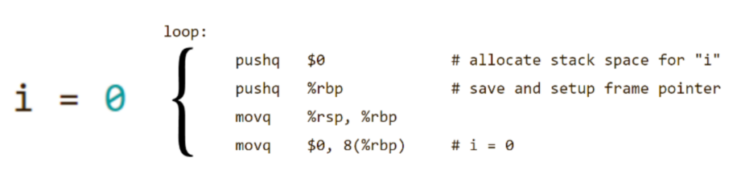
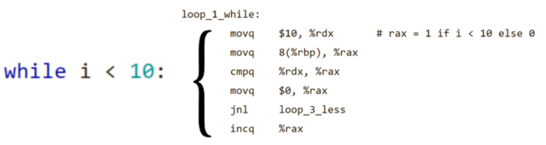
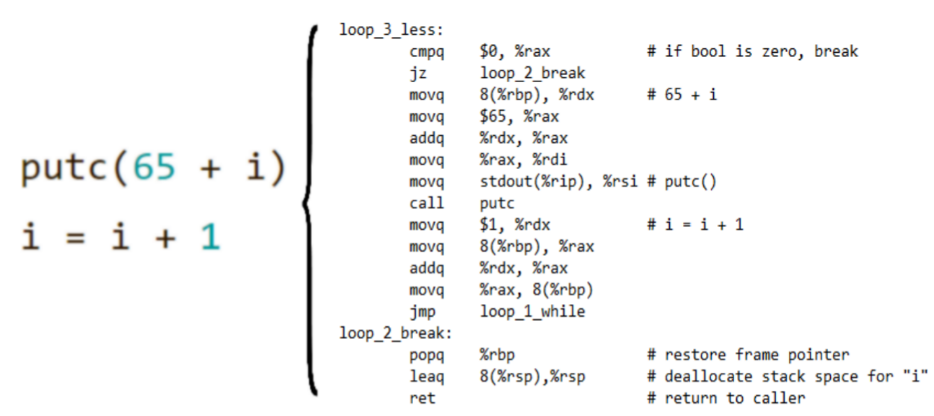
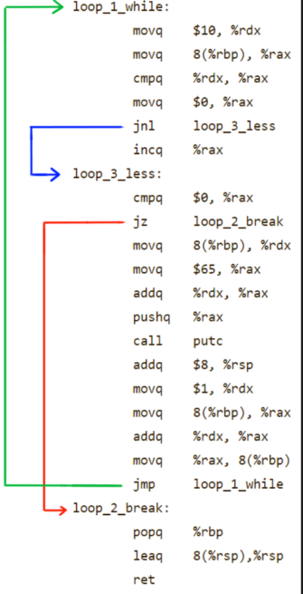

---
title:
  Instituto Tecnológico de Costa Rica\endgraf\bigskip \endgraf\bigskip\bigskip\
  Investigación - Generación de Código \endgraf\bigskip\bigskip\bigskip\bigskip
author:
  - José Morales Vargas, carné 2019024270
  - Alejandro Soto Chacón, carné 2019008164
  - José Alejandro Chavarría Madriz, carné 2019067306
  - Natalia González Bermúdez, carné 2019165109
date: \bigskip\bigskip\bigskip\bigskip Area Académica de\endgraf Ingeniería en Computadores \endgraf\bigskip\bigskip\ Lenguajes, Compiladores \endgraf e intérpretes (CE3104) \endgraf\bigskip\bigskip Profesor Marco Hernández Vásquez \endgraf\vfill  Semestre I
header-includes:
  - \setlength\parindent{24pt}
  - \usepackage{url}
lang: es-ES
papersize: letter
classoption: fleqn
geometry: margin=1in
fontsize: 12pt
fontfamily: sans
linestretch: 1.15
bibliography: investigacion.bib
csl: /home/josfemova/UsefulRepos/styles/ieee.csl
nocite: |
  @crcc, @icld
output:
  pdf_document:
    fig_caption: true
...

\maketitle
\thispagestyle{empty}
\clearpage
\tableofcontents
\pagenumbering{roman}
\clearpage
\pagenumbering{arabic}
\setcounter{page}{1}

# Objetivos

- Explicar los conceptos básicos detrás de la etapa de generación de código en un compilador actual.
- Describir los pasos mínimos requeridos a la hora de generar código en un compilador.
- Explicar una implementación ad hoc para generación de código en tiempo de ejecución.
- Brindar un ejemplo conceptual para ilustrar el proceso de generación de código.

# Introducción

En la presente investigación se pretende ahondar en una de las etapas llevada a cabo durante el proceso de compilación, conocida como generación de código. Para ello se comenzará con una explicación de los conceptos básicos a manejar para comprender a cabalidad esta etapa, a su vez se explicarán los pasos mínimos más comunes requeridos al generar código, esto con el fin de brindar una comprensión global del proceso de manera simplificada y teórica. Este segmento de la investigación se basa principalmente en “Introduction to Compilers and Language Design”[@icld].

Adicionalmente, valiéndonos del conocimiento en el primer segmento, se expondrá un procedimiento alternativo para la etapa de generación de código. Dicho procedimiento consiste en la generación de código en tiempo de ejecución, un método que pretende generar código especializado creado rápidamente de manera dinámica, mediante el uso de templates y código precompilado. Para esta sección se ha utilizado como base “Compiling for Runtime Code Generation”[@crcc].

Finalmente se procederá a describir un ejemplo conceptual completo para reforzar los conceptos y crear una mayor cercanía con los temas, principalmente, de la primera sección de la investigación.

# Generación de código

## Generación de código y diseño de lenguaje

La generación de código constituye la etapa final del proceso de compilación. En este punto es generado, a partir de una serie de procesos, el código en el lenguaje meta, por lo general lenguaje máquina. En el capítulo _Generación de código y diseño de lenguaje_ se desarrollan ejemplos enfocados en el código ensamblador X86-64 ya que es fácil de adaptar a cualquier otro lenguaje ensamblador y se aborda el proceso en varias etapas o elementos básicos del programa y sin utilizar métodos muy complejos, esto quiere decir que el programa resultante no es óptimo.
 
### Funciones de apoyo
 
Primero se deben generar algunas funciones de apoyo que responden a la necesidad de registros temporales, para seguidamente generar expresiones. Los registros que se reservan tienen un número r, un nombre y un estado, además, pueden ser utilizados para gestionar la pila, para argumentos de funciones o para valores temporales.
Las funciones abstraidas son `scratch_alloc`, `scratch_free` y `scratch_name`. La función `scratch_alloc` se utiliza para encontrar algún registro reservado disponible y retorna su número o un mensaje de error. Si no se encuentra ninguno, `scratch_free` marca a los registros como disponibles y `scratch_name` retorna el nombre de un registro según su número.
Seguidamente se deben escribir las funciones `label_create` y `label_name` para crear labels únicas y anónimas que indican ramas condicionales o los objetivos de los saltos. Con `label_create` se incrementa un contador global y se retorna su valor y con `label_name` se retorna el nombre en forma de string, por ejemplo, el string equivalente al label 5 es “.L5”.
Por último se necesita una función `symbol_codegen` para mapear los símbolos de un programa con los símbolos de código ensamblador. Esta función examina las posibilidades del símbolo y retorna un string con el fragmento de una instrucción que representa el cálculo de la dirección que se necesita para ese símbolo. En el caso de una variable global es simple, si se tiene la estructura `count:integer`, la función simplemente retorna `count`. En el caso de variables locales y parámetros de una función, debería retornar el cálculo de la dirección exacta que tiene la posición de esa variable o parámetro en la pila solo con conocer su posición en el marco de pila.
 
### Generación de expresiones

La forma más básica de generar código de ensamblador de una expresión es con un recorrido postorden del árbol abstracto de sintaxis o grafo dirigido acíclico (AST y DAG respectivamente por sus siglas en inglés) en donde cada nodo tiene una o varias instrucciones para mantener un control de los registros. Si se agrega otro campo a los nodos para guardar el número de registro que se obtiene con `scratch_alloc` y por cada nodo que se visita se emite una instrucción y se coloca el número del registro que contiene ese valor en el nuevo campo. Cuando ya no se necesita se llama a `scratch_free` para liberarlo. 
Para lograr esto se crea una función `expr_codegen` que se llama recursivamente con su hijo izquierdo y derecho, cada hijo va a generar un código y su resultado va a guardarse en el campo de registro y por cada nodo se va a generar código con esos resultados y va a liberar los que no se utilicen. Para este proceso hay que considerar que algunos nodos requieren varias instrucciones, por ejemplo en X86 IMUL solo puede tener un argumento, `%rax`, y el resultado se posiciona en `%rax` y lo que se desborda en `%rdx`, por lo que se deben ir moviendo los resultados a registros temporales. Otra consideración es la llamada de funciones `CALL` donde cada argumento es un árbol desbalanceado de ARG nodos, el generador de código debe evaluar cada nodo y dependiendo de la convención de la máquina se debe realizar un `PUSH` al stack o se generan todos los argumentos y se copian a los registros respectivos para luego hacer un `CALL` al nombre de la función. Cuando la función retorna su valor, este se mueve del `%rax` a un registro temporal y se restauran los registros que guardan llamadas.

### Generación de estructuras

Ahora que se pueden generar expresiones con la función `expr_codegen`, se podrían generar estructuras de código que utilicen dichas expresiones. Se puede crear una función `stmt_codegen` que va a contener el código para el control de declaraciones. Se pueden tener varios casos, si la declaración es de una variable local (`STMT_DECL`) entonces se llama a la función `decl_codegen`, si es una expresión (`STMT_EXPR`) se llama a `expr_codegen` para luego liberar el registro temporal que contiene el valor de la expresión con `scratch_free`. También debe haber un caso de retorno `STMT_RETURN` que evalúa la expresión, la mueve al `%rax` y luego hace un salto a una función que desenvuelve la pila y vuelve al punto de llamado. Se pueden crear casos para declaraciones condicionales como los `if` y `else` así como para generar ciclos `for`. En el caso de un `print`, al ser una función imperativa con comportamiento que varía según el tipo de expresión que se quiere imprimir, se debe generar una función diferente para cada tipo y una función llamada `expr_typecheck` para determinar el tipo y llamar a la función correspondiente.
 
### Expresiones condicionales

Las expresiones condicionales (mayor que, menor que, igual, etc) comparan dos valores y retornan un booleano, usualmente aparecen en las funciones de control de flujo de expresiones pero pueden ser utilizadas como valores simples. Sin embargo, no existe una instrucción que compare los valores y escriba el resultado en un registro por lo que se debe construir un control de flujo que compare las dos expresiones y construya el resultado. Para diferentes operadores se utilizan diferentes saltos al lugar indicado y con algunas modificaciones se podría utilizar para implementar el operador condicional ternario. Si se utiliza este método para un `if` en el lenguaje utilizado habrían dos estructuras condicionales en ensamblador, la primera para computar la condición y ponerla en un registro y la segunda para comparar los resultados y saltar a el caso verdadero o el falso.

### Generación de declaraciones 

Para emitir el programa completo se debe recorrer cada declaración de código o datos y emitir su estructura. Las declaraciones de datos globales emiten una etiqueta junto con indicador que reserva el espacio necesario y un inicializador, en caso de ser necesario, que por ser una variable global debe ser una constante. 

Para las declaraciones de variables locales se asume que el espacio fue reservado por la función por lo que no se necesita manejo de pila, pero, si la variable viene inicializada se debe generar código, almacenarlo en la variable local y liberar el registro.

Para generar declaración de funciones se debe emitir una etiqueta con el nombre de la función seguido por el prólogo de la función que debe tomar la cantidad de parámetros y funciones locales, y crear el espacio respectivo en la pila. Luego debe tener el cuerpo de la función seguido por su epílogo, que debe contener una etiqueta única para que las expresiones de retorno puedan hacer un salto fácilmente.

### Ejemplo de generación de código

Para ilustrar el proceso de generación de código se analizará un ejemplo sencillo presentando el significado del código traducido así como su origen y el proceso que lo genera.
Analicemos el siguiente código:
Código fuente: 
```
i = 0
while i < 10:
    putc(65 + i)
    i = i + 1
```
Código generado:
``` 
loop:
        pushq   $0              # allocate stack space for "i"
        pushq   %rbp            # save and setup frame pointer
        movq    %rsp, %rbp
        movq    $0, 8(%rbp)     # i = 0
loop_1_while:
        movq    $10, %rdx       # rax = 1 if i < 10 else 0
        movq    8(%rbp), %rax
        cmpq    %rdx, %rax
        movq    $0, %rax
        jnl     loop_3_less
        incq    %rax
loop_3_less:
        cmpq    $0, %rax           # if bool is zero, break
        jz      loop_2_break        
        movq    8(%rbp), %rdx      # 65 + i
        movq    $65, %rax          
        addq    %rdx, %rax         
        movq    %rax, %rdi         
        movq    stdout(%rip), %rsi # putc()
        call    putc               
        movq    $1, %rdx           # i = i + 1
        movq    8(%rbp), %rax      
        addq    %rdx, %rax          
        movq    %rax, 8(%rbp)      
        jmp     loop_1_while        
loop_2_break:
        popq    %rbp               # restore frame pointer
        leaq    8(%rsp),%rsp       # deallocate stack space for "i"
        ret                        # return to caller
```
Analicemos el primer fragmeto:

{width=50%}

`i = 0` es una declaración, por lo que para generar el código en X86 se utiliza el procedimiento anteriormente especificado para la generacion de declaraciones. Es especificamente las dos primeras lineas `pushq` donde se crea un espacio para `i` y un puntero. Las siguiente dos, `movq`, asignan los valores a ambas variables.

{width=50%}

`while i < 10:` es una estructura que genera un loop, para generar el código se utilizan los procedimientos descritos en “Generación de estructuras”. Para este caso únicamente se analiza la declaración del while y su condición. Estos generan el código de la figura 2. Las primeras 3 líneas se utilizan para evaluar la condición. `cmpq` NO activa un flag si `i < 10`, de lo contrario si lo activa. `jnl` es un salto condicional (Salto si no es menos). Si el flag está activo salta directamente a `loop_3_less`, tal como se aprecia en la figura 4. Si no, primero pasa por `incq` que incrementa el valor de `rax` en 1, que gracias a `movq $0 , %rax` era cero, por lo que pasaría a ser 1. 

{width=50%}

Para este caso nos encontramos dentro del ciclo, y tenemos las expresiones internas del ciclo. El código generado contempla que se está dentro de un ciclo y además genera el código de cada expresión. Primero, se evalúa si `rax` es 0. Si es cierto el flag zero se activa. En la siguiente línea `jz` es un salto condicional que se ejecuta si el flag zero está activo. De ser así se salta a `loop_2_break` (ver figura 4). Comenzado con la expresión interna de putc las siguientes 4 líneas se encargan de generar el valor de `65 + i`. Las siguientes dos hacen el llamado a la función `putc`. Y el resto, menos `jmp`, que realiza el salto de nuevo a loop para crear el ciclo, son el producto de `i = i + 1`. Vale la pena analizar que esas 4 instrucciones podrían ser sintetizadas en `addq $1, 8(%rbp)` o inclusive `incq 8(%rbp)`, lo que sugiere que este código puede ser optimizado (tal como se mecionaba al comienzo de la investigación), un resultado como esos sería un producto de una sintaxis como `i++`, pero como la expresión es distinta el compilador “toma el camino largo”. Finalmente el último segmento simplemente desaloja las variables y retorna a la función que lo llamó.

{width=30%}

## Generación de código en tiempo de ejecución

El artículo cubre la técnica de _Generación de código en tiempo de ejecución_ o RTCG por sus siglas en inglés. La última es una técnica de procesamiento de código que permite la generación dinámica de código compilado durante el tiempo de ejecución mismo.

La técnica de compilado en tiempo de ejecución debe hacer un balance entre dos factores fundamentales: tiempo de compilación y optimización de código.

El artículo cubre este tema usando como ejemplo un lenguaje desarrollado por los autores llamado Cyclone, el cual es estáticamente tipado. Este lenguaje se transpila a una variante tipada de lenguaje ensamblador. Se menciona que durante el proceso de transpilado, anteriormente, para el código que era generado en tiempo de ejecución no tendría optimización alguna, lo que aumentaría el costo en recursos computacionales, y podría contrarrestar la ventaja de la generación de código de forma dinámica.

Se mencionan varios acercamientos para poder conseguir generación de código en tiempo de ejecución, entre ellas un modelo basado en templates sin optimizaciones, otro con manipulación de strings que son posteriormente compilados en tiempo de ejecución por un compilador convencional por lo tanto asegurando una optimización de código adecuada. Los autores deciden utilizar un tercer acercamiento, el cual consiste en analizar el flujo de datos de las funciones de generación de código de forma que se pueda obtener un grafo que caracteriza de forma general los posibles productos de la función generadora, esto permite realizar optimizaciones sobre los elementos de la función producto.

Para guiar en el tema, los autores introducen su lenguaje Mini-Cyclone, la variante experimental del lenguaje cyclone que se mencionó anteriormente. Este lenguaje no se compila directamente a lenguaje máquina, sino que su compilado es a un lenguaje intermedio que los autores llaman CIR (Cyclone Intermediate Representation). Este lenguaje mencionan es relativamnete estándar, un IR de bajo nivel y basado en bloques.

Para comprender mejor el árticulo es escencial notar en especial algunos componentes del lenguaje que son fundamentales:

- `codegen` Es la principal expresión generadora de funciones de manera dinámica, es decir, la expresión se utiliza para crear las funcinoes generadoras de código dentro del programa. En mini-Cyclone, esta expresión genera la función y retorna un puntero a la misma.
- `fill` Es una expresión que permite evaluar expresiones dentro de una sección de `codegen` a partir de parámetros pasados anteriormente a codegen, es decir, aquello que englobe fill será evaluado antes de la generación de código de la función producto.
- `cut` Es una sentencia que se utiliza para remover las partes de código utilizadas para generación que no son necesarias en la instancia generada.
- `splice` Sentencia que permite conservar una sección de código de la función generadora dentro de la función generada, dado que la sección de código a conservar se encuentre envuelta dentro de un cut.

### Metodología de traducción general

### Traducción de constructos que participan en la generación de código

### Optimización y uso de CFG

#### Etapa de análisis

#### Etapa de transformación


# Conclusiones generales

# Conclusiones específicas

- Antes de poder generar expresiones, hace falta ser capaces de alojar, nombrar y liberar registros en el procesador. 
- Es posible generar código para expresiones si estas son representadas como estructuras AST o DAG y recorridas en postorden.
- En ocasiones una única expresión puede generar multiples líneas de código ensamblador, esto de debido a alojos y desalojos de registros o casos especiales como `IMUL` de X86.
- Dependiendo de la forma en que se realice la generación de código una etapa de optimización después es fundamental para asegurar la eficiencia.
- Es posible implementar estructuras complejas como condicionales y ciclos utilizando únicamente saltos condicionados entre distintos fragmentos de código secuencial en ensamblador.


# Bibliografía

::: {#refs}
:::
